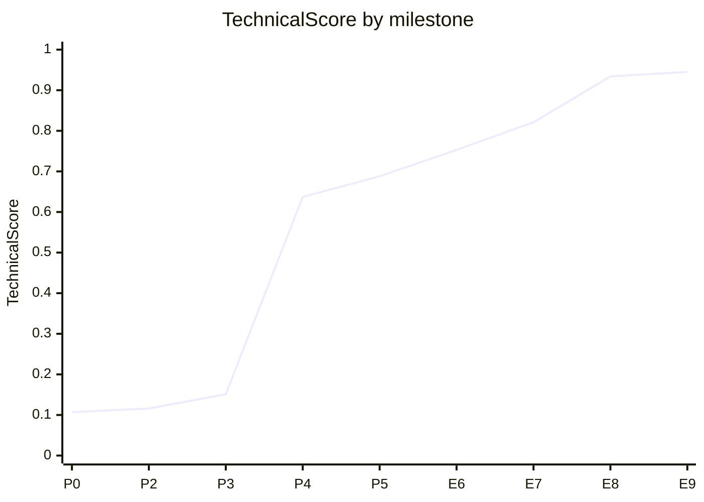

# Conversational Shopping Agent: chud-pro-max-shopinator

Our entry for the **TechJam Conversational E-Commerce Search Challenge**.

The agent receives an anonymised customer profile and a short opening message, then has
up to ten turns to surface a hidden target product from a frozen catalogue of 50,000
Amazon clothing items, asking one clarifying question per turn as it goes.

It is deterministic, runs on the Python standard library, works offline, and uses no
model and no API.

| metric | starter BM25 | this agent |
|---|---|---|
| **TechnicalScore** | 0.106710 | **0.945497** |
| Hit Rate@10 | 0.125 | **1.000** |
| MRR | 0.068034 | **0.938657** |
| MTTC (mean turns to convert) | 9.81 | **2.805** |

Hit Rate@10 is 1.000 on each of the four scenario types separately: Buying, Browsing,
Intent Override and Boundary.

```bash
python3 -m evaluator.local_evaluator     # no dependencies, no network, no env vars
```

> Python 3.10+. Nothing to `pip install`. The one prerequisite is the 60 MB catalogue,
> which is not stored in git — **[docs/SETUP.md](docs/SETUP.md)** has the four commands
> that fetch and verify it, plus every ablation, flag and test command.

---

## Contents

- [The idea](#the-idea)
- [How it finds the target](#how-it-finds-the-target)
- [One session, end to end](#one-session-end-to-end)
- [Results](#results)
- [Architecture](#architecture)
- [Cost, latency and resource use](#cost-latency-and-resource-use)
- [The one model we built, and then deleted](#the-one-model-we-built-and-then-deleted)
- [How decisions were made](#how-decisions-were-made)
- [Limitations and what we would improve](#limitations-and-what-we-would-improve)
- [Team contributions](#team-contributions)
- [Where everything is](#where-everything-is)

**Going deeper:** [`docs/experiments/`](docs/experiments/) holds the nine decision records
(E1–E9) — every measurement, the reasoning behind each choice, and the ideas we rejected.
[`docs/SETUP.md`](docs/SETUP.md) is the operator's manual.

---

## The idea

Our central finding is that the useful question on this task is a **structural** one
rather than a semantic one.

The hidden intent card is not free text. The evaluator builds it by walking the target
product's own `features` and `details` and taking whole values: one complete list
element, or one complete `key: value` pair, normalised, trimmed and clipped at 180
characters. Every constraint the customer can ever disclose is therefore an exact member
of a small set that the target product owns.

So the sharpest test of a candidate is not whether its text resembles what the customer
said, since near-duplicate listings all pass that. It is **whether the candidate would
have produced those exact strings**. Everything below follows from asking it that way.

The agent uses no LLM and no external API. That was a measured outcome rather than
something we skipped: we built a full dense semantic route in Phase 3, measured it, and
[took it back out](docs/dense_route.md). The code and the flag are still here.

---

## How it finds the target

Four mechanisms, all following from the ownership observation above.

### 1. Slot ownership — `shopping_agent/slots.py`

Each candidate is scored on the share of the customer's disclosures it owns **as whole
values**, weighted by how rare each disclosure is within the current candidate pool.
"Machine wash cold" buried inside a competitor's longer bullet point is not evidence.
The same string standing alone as one of its feature values is.

Measured over the 50,000-row catalogue and the 200 public sessions:

- the target owns all 800 of its disclosable constraints as exact values, so requiring
  the match can never cost us a hit;
- 193 of those 800 constraints are owned by exactly one product in the whole catalogue;
- given the opening category plus two disclosures, the median consistent set is already
  a single product; with four disclosures it is a single product for 169 of 200 sessions.

Selectivity is what makes this usable. A material label like "cotton" is owned by
thousands of rows and tells you nothing, while a sixteen-word care instruction is often
unique. Weighting by pool-local rarity needs no catalogue-wide index and calibrates
itself against whichever candidates are actually competing.

This is a ranking feature and never a filter. If a split paraphrases instead of quoting,
no candidate owns anything, every score comes out 0.0, and the ordering falls back to the
features underneath.

### 2. Retrieve inside the stated category — `starter/agent.py`, `shopping_agent/slots.py`

The opening line names the target's coarse category word for word, in every scenario, on
turn 1. For Browsing sessions it is the only thing said before any question is answered.
We reproduce the generator's category function exactly, and verified it over the whole
catalogue rather than by sampling:

| check | result |
|---|---|
| our `coarse_category` vs the evaluator's, over 50,000 products | 0 disagree |
| openers whose category did not extract exactly | 0 / 200 |
| targets not reproducing their own stated category | 0 / 200 |

So the target is guaranteed to be inside the restricted set. The catalogue holds 1,115
coarse categories and the median target shares its own with 184 products, so a 400-deep
pool now covers an entire category instead of 0.8% of the catalogue.

**This fixed our last remaining miss.** It was an Intent Override session whose card was
entirely generic (`polyester`, `100% Polyester`, `Imported`, `Zipper closure`), so every
disclosure flooded the query with terms that tens of thousands of rows match. The target
was never reaching the pool. Because it was a *retrieval* failure rather than a *ranking*
one, five phases of ranking work had never touched it. It also made a full evaluation
pass 35% faster, from 41 s to 26 s.

The filter fails quietly in three ways, each covered by a test in
`tests/test_phase6_category_filter.py`: an opener the agent cannot parse yields no
category; a category no product reproduces is not applied; and a filtered search
returning nothing reruns unfiltered.

### 3. Ask the open-ended question first — `shopping_agent/clarification.py`

The simulator answers `other` with any undisclosed constraint, so its yield is always at
least as high as any specific attribute's, at every point in the conversation. We had it
queued behind six narrower questions, and 44 of the 200 sessions were not draining their
card until turn 8 purely because of that ordering. Moving it up improves MTTC
monotonically the whole way, from 3.900 to 3.655.

The policy also knows which attributes are unreachable. `brand` and `category` can never
be returned by the evaluator's `classify_constraint()`, and `budget` is unreachable in
practice, so it never spends a turn on any of them.

### 4. Only return a shortlist the agent can defend — `shopping_agent/shortlist.py`

The evaluator ends a session as soon as the target appears anywhere in the returned list,
and **freezes** the rank it appeared at. That makes a turn-1 list padded out to ten a
gamble: a target at rank 7 ends the session at reciprocal rank 0.14, and the eight
further turns of disclosure that would have lifted it to rank 1 never happen.

This was measurably the Buying scenario's problem — best HitRate of any scenario at
0.9875, worst MRR at 0.6516, because it opens by disclosing a material label that
thousands of rows own.

So while the agent is still narrowing the field it returns its single best candidate
alongside its question, and the full ten once it has something to stand behind. The
widening conditions are measured rather than scheduled, and any of three will do it: the
field is narrowed to one candidate; the high-yield questions are used up; or the customer
has disclosed something and no candidate owns any of it. That last one is the paraphrase
signal, and it switches the policy off entirely on a distribution it cannot read.

Please read [the caveat](#the-shortlist-policy-is-shaped-by-this-metric) before defending
this one.

### Everything is inspectable

Every feature's contribution to a candidate's score is recorded and printable via
`RerankedCandidate.explain()`, so we can read off why something ranked where it did. This
paid for itself early: our first reranker weighting scored worse than no reranking at
all, and the per-feature breakdown is how we found which feature was responsible.

---

## One session, end to end

`python3 -m scripts.demo_session` prints the hidden target and intent card up front —
everything the agent is not allowed to see — then every turn. Here is `public_0001`
abridged, a Buying session that shows most of the system in two turns:

```text
--- turn 1 -------------------------------------------------------------------
customer  I'm looking for Jewelry Necklaces. A key requirement is: Material:alloy.
agent     Here are the closest matches based on category=jewelry. Is there
          anything else that matters to you?
ask       'other'
returns   1 recommendation
              1. B075KXNBNF  OIDEA Double Mens Punk Cool Black Military Dog Tag…

--- turn 2 -------------------------------------------------------------------
customer  For that, what matters is: Triple Moon Pentagram Symbol; The Triple
          Moon represents the Phases of the Moon which are linked to the three
          aspects of the Goddess and the phases of the Life of Women…
agent     Here are the closest matches based on category=jewelry. Which features
          matter most to you?
ask       'feature'
returns   10 recommendations
          >>  1. B09PYB7B6Z  QIAN0813 Celttic Knot Triple Moon Pentagram Pentacle…
              2. B075KXNBNF  OIDEA Double Mens Punk Cool Black Military Dog Tag…
              …
          ** target found at rank 1 — the evaluator stops here **

 HIT on turn 2 at rank 1   reciprocal rank 1.000
```

On turn 1 the shortlist policy declines to pad the list: `Material:alloy` is owned by
thousands of rows, so the agent returns the one candidate it can defend and asks the
open-ended question instead. On turn 2 it gets two quoted card values back, slot
ownership fires, and the target goes to rank 1.

The demo loop imports every evaluator-side function rather than reimplementing any of it,
so a transcript cannot drift from what the official scorer saw. See
[docs/SETUP.md](docs/SETUP.md#see-one-session-end-to-end) for the other scenarios.

---

## Results

Full public set, 200 sessions, `python3 -m evaluator.local_evaluator` with no environment
variables.

| | Hit Rate@10 | MRR | MTTC |
|---|---|---|---|
| **overall** (200) | **1.000** | 0.938657 | 2.805 |
| buying (80) | 1.000 | 0.973036 | 2.288 |
| browsing (80) | 1.000 | 0.908904 | 2.813 |
| intent_override (30) | 1.000 | 0.928095 | 3.867 |
| boundary (10) | 1.000 | 0.933333 | 3.700 |

**Hit Rate@10** is the fraction of sessions that find the target within 10 turns. **MRR**
is the mean reciprocal rank of the target, a miss contributing zero. **MTTC** is the mean
first-hit turn, a miss assigned turn 11.

```text
TechnicalScore = 0.50 × HitRate@10 + 0.30 × MRR + 0.20 × Efficiency
Efficiency     = clip((11 - MTTC) / 10, 0, 1)
               = 0.50 × 1.000 + 0.30 × 0.938657 + 0.20 × 0.8195  =  0.945497
```

### How we got here



| milestone | Score | HitRate | MRR | MTTC |
|---|---|---|---|---|
| starter BM25 | 0.106710 | 0.125 | 0.068034 | 9.810 |
| P2 constraint-aware lexical retrieval | 0.115573 | 0.135 | 0.074575 | 9.715 |
| P3 dense + weighted fusion | 0.151089 | 0.180 | 0.088964 | 9.280 |
| P4 clarification + deterministic reranker | 0.636663 | 0.755 | 0.471877 | 5.120 |
| P5 dense route removed | 0.687598 | 0.820 | 0.512661 | 4.810 |
| P5 + disclosed-evidence scoring | 0.706484 | 0.830 | 0.550613 | 4.685 |
| P5 short-label evidence + retuned tie-breakers (E6) | 0.753328 | 0.870 | 0.605760 | 4.170 |
| P5 phrase containment + widened pool (E7) | 0.821381 | 0.950 | 0.659603 | 3.575 |
| P6 slot ownership (E8) | 0.853005 | 0.975 | 0.698018 | 3.195 |
| P6 + confidence-sized shortlist (E8) | 0.876118 | 0.970 | 0.833060 | 3.940 |
| P6 + open question asked first (E8) | 0.881931 | 0.965 | 0.836770 | 3.580 |
| P6 + exact stated category (E8) | 0.929426 | 0.990 | 0.912421 | 2.965 |
| P6 + pool depth re-priced to 400 (E8) | 0.933701 | 0.995 | 0.910671 | 2.850 |
| P6 + disclosure-gated shortlist widening (E9) | 0.942229 | 0.995 | 0.942764 | 2.905 |
| **P6 + category-filtered retrieval (E9)** | **0.945497** | **1.000** | **0.938657** | **2.805** |

Two rows go backwards on a component metric and forwards on the composite. The shortlist
policy costs HitRate 0.975 → 0.970 and buys MRR 0.698 → 0.833; the category filter costs
MRR 0.943 → 0.939 and buys the last hit. Both are the expected shape rather than a
surprise, and both are explained where they happen.

The single largest contributor is clarification. The simulator discloses a hidden
constraint only when asked, so before P4 three of the four scenarios landed every hit on
turn 1 and turns 2 through 10 contributed nothing at all.

---

## Architecture

```
customer message
      │
      ▼
ConversationOrchestrator          shopping_agent/orchestrator.py
   parse the opener · absorb the answer to our last question ·
   detect intent overrides · accumulate disclosed constraints across turns
      │
      ▼
retrieve()                        shopping_agent/retrieval.py
   BM25 over SQLite FTS5, restricted to the stated coarse category,
   400-deep pool (plus an optional dense route, off by default)
      │
      ▼
rerank()                          shopping_agent/reranking.py
   deterministic 10-feature scorer, led by slot ownership,
   phrase containment and token coverage. No learned parameters.
      │
      ▼
shortlist_size()                  shopping_agent/shortlist.py
   return only as many results as the evidence supports
      │
      ▼
choose_attribute()                shopping_agent/clarification.py
   pick the question with the highest expected yield
```

`starter/agent.py` exports the required `Agent` interface unchanged — `reset(session_id,
user_profile)` and `respond(session_id, user_message, turn, top_k)`, returning `message`,
`ask_attribute`, `recommendations` and `usage`, per
[`docs/agent_api_contract.json`](docs/agent_api_contract.json). Behind it are fourteen
modules with one responsibility each; the [module map](docs/SETUP.md#module-map) names
them all.

### Failure handling

Nothing that can go wrong is allowed to cost a session, and no degradation is silent:

- a reranker exception falls back to the fused retrieval order instead of raising into
  `respond()`;
- a clarification failure asks nothing rather than losing the turn;
- an empty filtered search reruns unfiltered;
- the dense route, when enabled but unavailable, serves BM25 results instead;
- every degradation prints its reason once to stderr, so a degraded run is visible rather
  than just quietly scoring lower.

169 unit tests cover this, standard library only, in about 5 seconds.

---

## Cost, latency and resource use

**Model / API: none.** Measured over the full 200-session public set (561 agent turns) on
Apple Silicon, Python 3.13.6.

| | |
|---|---|
| model / API | none |
| network required | no |
| prompt + completion tokens | 0 |
| estimated cost per session | $0.00 |
| cold start (indexing 50,000 products) | 4.2 s, once per process |
| per-turn latency | 37 ms median, 80 ms p95, 242 ms max |
| full 200-session evaluation | 28 s |
| peak RSS (whole process, agent plus evaluator) | 0.76 GB |
| dependencies on the scored path | none, standard library only |

Being deterministic and offline means the agent holds up under the organiser's stated
right to score submissions with network access disabled, and under CPU, memory and
timeout restrictions. There is no rate limit to hit, no key to rotate, and no per-session
bill that scales with traffic.

---

## The one model we built, and then deleted

Phase 3 built a dense semantic route in full: MiniLM embeddings over all 50,000 products,
benchmarked against `bge-small-en-v1.5`, fused with BM25 by both RRF and weighted
blending. It was worth **+0.0355** at the time. By Phase 5 it was a **loss of 0.0509**, and
we took it out.

| configuration | before clarification (E2) | after clarification (E5) |
|---|---|---|
| lexical only | 0.115573 | **0.687598** |
| dense + RRF | 0.145170 | 0.636669 |
| dense + weighted | **0.151089** | 0.636663 |

What changed in between was clarification. Once the customer answers questions by quoting
constraint sentences out of the target's own text, and those quotes accumulate across
turns, the two routes stop being comparable. Asking each one separately whether it still
held the ground-truth target in a 50-candidate pool shows why:

| turn | median query words | lexical recall | dense recall |
|---|---|---|---|
| 1 | 12 | 0.3800 | 0.3200 |
| 2 | 15 | 0.4200 | 0.2200 |
| 3 | 24 | 0.7100 | 0.2550 |
| 5 | 29 | 0.7450 | 0.3000 |
| 10 | 36 | 0.7400 | 0.3600 |

At turn 1 the routes are even, which is the world E1 and E2 measured in — their conclusion
was right for it. From turn 2 they come apart: lexical recall nearly doubles while dense
stays flat, because BM25 sharpens as rare terms accumulate whereas one fixed-width
sentence embedding averages a growing paragraph toward the corpus mean. P3's decision was
not wrong; it expired.

**E10 re-measured it again, and the number above no longer describes the agent that
ships.** At the P6 ranking, against both a quoting and a paraphrasing customer:

| | verbatim | paraphrased |
|---|---|---|
| dense off | **0.945497** | 0.696015 |
| dense on | 0.944254 | 0.697829 |

Dense costs **0.0012** today rather than 0.0509 — the evidence and category features added
after E5 now do most of what the fusion was doing — and it *gains* 0.0018 once the customer
stops quoting verbatim. Still off by default, because 0.0012 certain against 0.0018
contingent needs roughly a 40% chance that the private set paraphrases to break even, and
the flip would cost the headline HitRate of 1.000. The honest summary is that the route is
now about free rather than expensive — a third distinct verdict on the same route, after
+0.0355 at P3 and -0.0509 at P5. Full table in
[docs/experiments/E10-p6-paraphrase-robustness.md](docs/experiments/E10-p6-paraphrase-robustness.md).

We kept the route, its flag and the prebuilt MiniLM artifact anyway, because the result is
about this query distribution rather than about dense retrieval in general —
`SHOPPING_AGENT_DENSE=1` turns it back on. Model choice, the rebuild procedure and the
per-scenario breakdown are in **[docs/dense_route.md](docs/dense_route.md)**.

---

## How decisions were made

The method mattered more than any individual idea, and four rules came out of it.

- **Measure everything, and keep the failures.** Every experiment is written up in
  `docs/experiments/`, including the ones that lost, with their numbers. Four of the nine
  records exist mainly so nobody re-tries a dead idea in six weeks.

- **A rejected idea is only rejected at the configuration you tested it on.** We priced
  the candidate pool depth five separate times and got a different answer each time: 50,
  then 100, then 250, then 400, and finally that it no longer matters at all, with depths
  from 200 to 1000 scoring identically to six decimals. Each new ranking feature changed
  what a deep candidate was worth. Blind shortlist truncation is the same story in
  reverse — it *lost* at the P5 ranking (0.816712 against 0.821381, HitRate falling 0.950
  to 0.920) and only became worth +0.023 once slot ownership made the top candidate right
  often enough.

- **Equal scores are not evidence that a code path ran.** Twice a change scored
  identically and the tempting move was to record it as neutral and keep it. Instead we
  counted how often the old and new code actually disagreed — for one of them, 0 of 591
  turns, so it was reverted rather than carried as a branch that does nothing. Count
  disagreements, not composites.

- **Check a reconstruction against the real thing, over everything.** The agent
  re-implements the simulator's logic twice, for slot ownership and for the coarse
  category. Both times we verified it against the actual implementation across all 50,000
  products rather than against hand-written test cases, which is the only reason a subtle
  punctuation bug was ever found. A hand-written expectation encodes the same
  misunderstanding as the code it is testing.

One consequence worth naming: answering "when should the agent show its full list?" meant
a 30-second evaluation run per variant, so `scripts/replay_ranks.py` records the target's
position at every turn in one pass and `scripts/replay_score.py` scores any candidate
policy in milliseconds. This is only valid because the simulated customer's replies depend
on our question and never on our recommendations. We proved the replay reproduced the live
evaluator exactly before trusting it, and it re-checks itself on every run.

---

## Limitations and what we would improve

### The shortlist policy is shaped by this metric

The evaluator breaks on the first hit and freezes the rank. Under a metric that scored the
best rank across all turns, withholding results would be worth nothing. We think it is
defensible as product behaviour — a precision-first agent that never returns a candidate
it would not defend and asks a question instead is arguably the better product, and
nothing in the rules requires returning ten ("only the first 10 valid unique
`parent_asin` values are scored" is a maximum, not a quota).

Still, it is the one change a reviewer could fairly call metric-shaped. So we isolated it
in a single module, documented it at length in `shopping_agent/shortlist.py`, and
`SHOPPING_AGENT_SHORTLIST=0` restores always-ten and measures 0.885293 (HitRate 1.000,
MRR 0.695645, MTTC 2.170). The other mechanisms are unaffected by it.

*Given more time:* measure it under a best-rank-across-turns metric, to establish how much
of its value is genuinely about precision and how much comes from the break rule.

### The agent assumes the customer quotes

Slot ownership, phrase containment and the exact-category filter all depend on the
simulator's verbatim behaviour. Each one fails quietly by design, so on a paraphrasing
split every candidate scores 0.0 and the ranking falls back to the features underneath.

**E10 measured that ceiling instead of arguing for it.** `scripts/paraphrase_eval.py`
replays all 200 sessions through a paraphrasing customer, changing only the customer's
outgoing text — the hidden card, the disclosure bookkeeping, the catalogue and the target
are untouched, and level 0 reproduces 0.945497 exactly, which is what makes the rest
trustworthy. Under synonym substitution the agent scores **0.696015** (HitRate 0.805)
against 0.945497 verbatim. So roughly a quarter of the composite is genuinely resting on
the customer quoting the target's own text back to us.

It also found that the fallback was not as quiet as this section used to claim. "Fails
quietly" is a property of a feature that only *scores*; the category apparatus is a
*filter*, and standing down is not free — it returns retrieval to the whole catalogue.
That accounted for 0.248 of the original 0.517 penalty, and it was recoverable, because
the filter was keyed to one English lead-in and one exact spelling of the category.
Accepting reworded openers and order-insensitive category names is worth **+0.2675
paraphrased, and exactly 0.000000 on the public set** — the submission score, HitRate,
MRR and MTTC are all identical to six decimals.

*Given more time:* the remaining 0.269 is the paraphrased disclosures themselves. That
needs stemming applied to both the FTS index and the evidence tokenizer together, or a
constraint-evidence feature scored by embedding similarity rather than token containment.
Full method, controls and held-out check in
[docs/experiments/E10-p6-paraphrase-robustness.md](docs/experiments/E10-p6-paraphrase-robustness.md).

### No language understanding, and no free-form conversation

`orchestrator.py` reproduces the generator's message format exactly and is tested against
it, but it parses one known English format rather than doing general language
understanding. The clarifying questions are likewise templated — which costs nothing here,
since the evaluator reads `ask_attribute` and never the prose. A real deployment would
need genuine intent parsing and real generation.

*Given more time:* a small local generator for the question text, so the conversation reads
naturally without bringing back an API dependency or a per-query cost.

### The customer profile is accepted and never used

`reset()` takes the anonymised `user_profile` and stores it on the session. Nothing
afterwards reads it: no retrieval, ranking or clarification decision depends on it. This
is a measured choice rather than an oversight — E8 recorded the profile as carrying
nothing about the target, and re-checking it across all 200 public sessions shows why:

- it has five fields, of which `purchase_frequency` is the string `3-4 prior purchases` in
  200 sessions out of 200;
- `preference_tags` name the attribute *categories* a shopper cares about — `fit`,
  `material`, `comfort` — never the values a constraint needs, such as `cotton`;
- no profile contains the target's `parent_asin`.

The profile describes the shopper's habits, while the intent card is built from the target
product's own field values. The two never meet, so there is nothing here to personalise on
and the spec's "safe personalization using the aggregate profile" direction has no purchase
on this data. We would rather say that than claim a personalisation feature that changes no
ranking.

*Given more time:* a deployment with genuine purchase history is a different question
entirely, and the profile is already threaded through to `SessionState` for exactly that.

### One known inconsistency, deliberately left in

`build_query_text` feeds the customer's declines into the BM25 query, while
`_absorb_answer` refuses to keep a decline as a disclosure. This looks like a bug and
isn't: 80 of the turns played are declines, and suppressing them costs four hits (0.945497
down to 0.920891). The query is far thinner than it looks — a median of 6 distinct terms,
with 2 turns collapsing to empty — so the decline text is acting as ballast. Recorded in
E9 because it will look like a bug to the next reader too.

### Where the remaining headroom is

HitRate is finished at 1.000 and cannot rise. What is left is MRR at 0.938657, worth at
most another +0.0184, and the reranker's entire adjustment half is now inert, so closing
that gap would take a new discriminator rather than a retune. MTTC of 2.805 is bounded
below by structure as much as by ranking, since an Intent Override session cannot register
a hit before its override turn, which falls on turn 3 or 4.

*Given more time:* generalise slot ownership beyond exact-value equality to a normalised
attribute graph, so it survives the messier structured data of a real catalogue; and
re-price every constant on a second product category, since all of them were tuned against
clothing.

---

## Team contributions

### Implementation

**Lin Minhong (@coffee-678)** — 65 commits
Phases 1, 2, 3, 5 and 6. Multi-turn conversation state and the orchestrator; the
constraint-aware lexical retrieval pipeline and price/category filtering; the dense
semantic route end to end (embedding benchmark, artifact build, vector adapter, RRF and
weighted fusion) and the measurement that later removed it; disclosed-evidence scoring,
phrase containment and pool-depth tuning; slot ownership, the exact stated category, the
confidence-sized shortlist policy and category-filtered retrieval. Experiment records E1,
E2, E5, E6, E7, E8, E9.

**Lim Ray Hing (@rayhing1510)** — 12 commits
Phase 4, which took the score from 0.151 to 0.637. The deterministic final scorer and its
inspectable feature checklist (P4-T1); one clarification question per turn and the
attribute-choice policy (P4-T2/T3); the failure-path hardening that guarantees nothing
escapes `respond()` (P4-T4); the reranker weight sweep harness and the retuning it drove;
the clarification ablation. Experiment records E3 and E4, plus the code-review remediation
for both P4 reviews (the lead-in cap bug, soft budgets, category neutrality, connection
hygiene) and repository hygiene for regenerable artifacts.

**Joel Rhys Chee (@Antelyuu)** — 8 commits
Phase 0 baseline checkpoint and the AI-readable phase execution skeleton that structured
the whole project; the agent behaviour documentation (`docs/agent_documentation.html`);
Phase 1 test coverage; Phase 2 constraint-safety work and audit; Phase 3 validation and
fallback hardening; bundling the MiniLM embedding artifact for offline use.

### External testing and score diagnosis

**Lim Dao Hao** and **Edrich Denzil Lim Yu** — component testing and score diagnosis, all
six phases

Two members worked outside the implementation branches, testing each phase's code as it
landed — independently of the people who wrote it — and turning an aggregate score back
into specific defects worth acting on. A phase's TechnicalScore tells you it is sitting at
0.63; it does not tell you what to do next.

They identified which sessions were failing and isolated the component responsible. A
target that never entered the candidate pool is a *retrieval* defect rather than a
*ranking* one, and the fixes have nothing in common — making that distinction is what
eventually located our last miss. They then broke each phase's score into the parts that
could still move, and recommended where the next phase's effort would pay.

Their diagnosis set the agenda for every phase, and is why this repository argues from
measurement rather than intuition. E7 is largely an account of where the remaining misses
lived, and it is what motivated the slot-ownership work in E8.

### Notes

Commits authored by `TechJam2026` are the organiser's original challenge scaffolding
rather than team contributions.

Every phase was merged only after a written code review. The findings and what was done
about them are recorded in the corresponding experiment file.

---

## Where everything is

| | |
|---|---|
| [`docs/SETUP.md`](docs/SETUP.md) | install, reproduce, ablations, config flags, tests, repo layout |
| [`docs/experiments/`](docs/experiments/) | E1–E9: every measurement, including the rejected ideas |
| [`docs/dense_route.md`](docs/dense_route.md) | the dense semantic route, and why we removed it |
| [`starter/agent.py`](starter/agent.py) | the official `Agent` entry point |
| [`docs/competition_specification.md`](docs/competition_specification.md) | the rules and evaluation protocol |

### Data attribution

The catalogue and sessions are derived from Amazon Reviews 2023 by McAuley Lab, UCSD. See
[`DATA_ATTRIBUTION.md`](DATA_ATTRIBUTION.md) before using or redistributing the data.
Sessions are sampled deterministically from the official Clothing 5-core leave-last-out
split and joined to the frozen catalogue.
